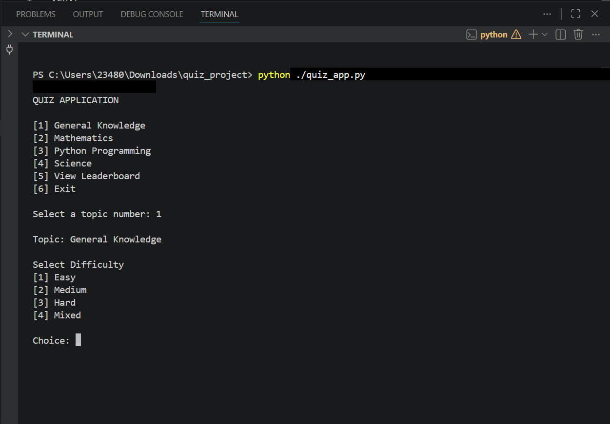

# Quiz Application

## Overview

A console-based quiz application built with Python. The application allows users to select quiz topics, choose difficulty levels, answer randomized questions, track scores, and view leaderboard rankings.

## Screenshot

### Quiz Main Menu



The application supports topic selection, difficulty filtering, score tracking, analytics, and leaderboard management.

## Features

* Dynamic topic selection
* Difficulty filtering
* Random question selection
* No question repetition
* Timer system
* Time bonus scoring
* Leaderboard persistence
* Session history tracking
* Performance analytics
* Wrong answer review
* JSON-based data storage

## Technologies Used

* Python
* JSON
* File Handling
* Modular Programming

## Skills Demonstrated

* Python Programming
* Modular Software Design
* JSON Data Management
* File Persistence
* Input Validation
* Randomization Algorithms
* Performance Analytics
* Command Line Application Development
* Software Engineering Best Practices

## Project Structure

```text
quiz_project/
│
├── assets/
│   └── quiz-main-menu.png
│
├── modules/
│   ├── quiz.py
│   ├── menu.py
│   ├── leaderboard.py
│   └── file_handler.py
│
├── quiz_app.py
├── questions.json
├── leaderboard.json
├── session_history.json
├── README.md
├── Road_map.md
├── functions.md
└── what_the_app_does.md
```

## Application Architecture

```text
User
  │
  ▼
quiz_app.py
  │
  ├── menu.py
  ├── quiz.py
  ├── leaderboard.py
  └── file_handler.py
          │
          ▼
    JSON Storage
```

### Module Responsibilities

#### quiz.py

Handles quiz logic, question selection, answer validation, scoring, timing, and performance analytics.

#### menu.py

Manages menu navigation, topic selection, difficulty selection, and user interaction.

#### leaderboard.py

Stores, retrieves, and displays leaderboard rankings and session statistics.

#### file_handler.py

Handles reading from and writing to JSON files used throughout the application.

## Data Storage

The application uses JSON files for persistent storage:

* `questions.json` stores quiz questions and answers.
* `leaderboard.json` stores player rankings and scores.
* `session_history.json` stores historical quiz sessions and analytics.

## How To Run

1. Clone the repository:

```bash
git clone https://github.com/Asabenasir/quiz_project.git
```

2. Navigate to the project directory:

```bash
cd quiz_project
```

3. Run the application:

```bash
python quiz_app.py
```

## Future Improvements

* User authentication
* GUI interface
* Database integration
* Online multiplayer mode
* REST API backend
* Docker containerization
* Unit and integration testing
* Admin dashboard

## Author

Asabe Nasir

GitHub: https://github.com/Asabenasir
